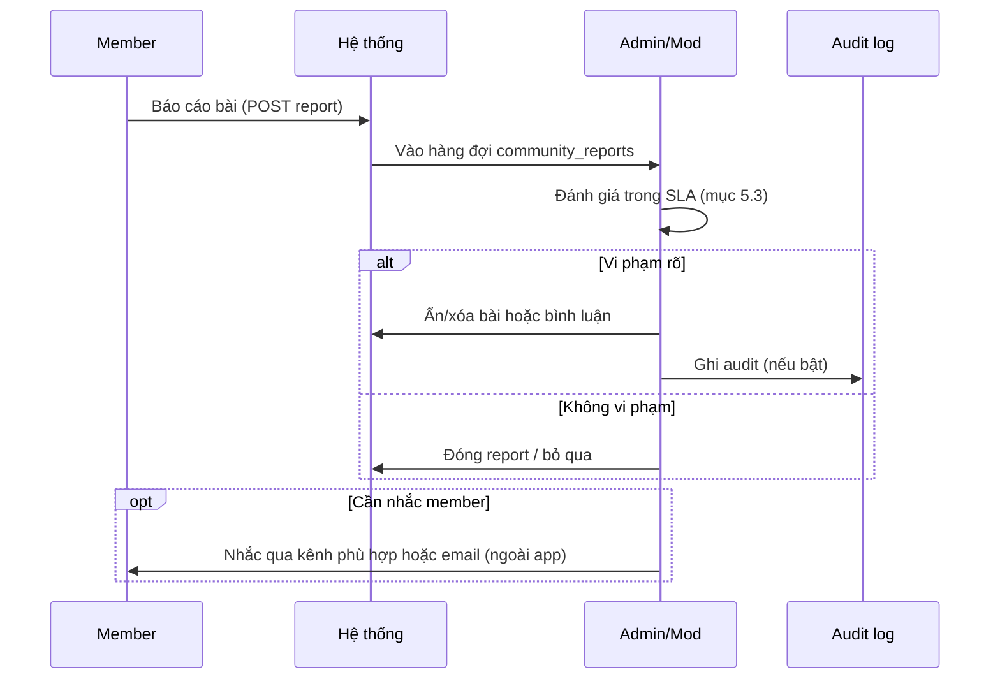

# Playbook vận hành cộng đồng Tezca (mô hình Discord)

Tài liệu này mô tả **cách vận hành** khu cộng đồng Tezca theo tinh thần Discord: cấu trúc kênh rõ ràng, vai trò & quyền, moderation có quy trình, và chỉ số theo dõi. Dùng cho admin, moderator, chuyên gia và người phụ trách sản phẩm.

**Liên quan:**

- Quy tắc pháp lý (user-facing): `/phap-ly/quy-tac-cong-dong`
- Domain kỹ thuật: `CONTEXT.md` (mục Cộng đồng)
- Khu sản phẩm: `/cong-dong/dien-dan`, `/cong-dong/phong-chat`, `/cong-dong/thong-bao`, `/cong-dong/tin-nhan`
- Kiểm duyệt admin: `/admin/quan-ly` + `/api/admin/community/`*

---

## 1. Tư duy Discord áp dụng cho Tezca


| Discord       | Tezca (hiện tại)                                                                          |
| ------------- | ----------------------------------------------------------------------------------------- |
| Server        | **Tezca Community** — một “nhà” chung cho thành viên đã đăng nhập (`/cong-dong`)          |
| Category      | Thông báo, Phòng chat, Diễn đàn, DM                                                       |
| Text channel  | Phòng chat 3 chủ đề + `#thong-bao` (read-only)                                            |
| Forum channel | Diễn đàn feed Threads (`community_posts`, luồng phản hồi)                                 |
| Role          | `admin`, `expert`, `user` (+ moderator 🔜 khi tách vai)                                   |
| Report        | Báo cáo bài → hàng đợi admin                                                              |
| DM            | DM cộng đồng (`/cong-dong/tin-nhan`) — **không** thay chat chuyên gia (`/app/ho-tro/...`) |


**Nguyên tắc vận hành:**

1. **Đúng kênh, đúng mục đích** — giảm nhiễu, dễ tìm câu trả lời.
2. **Công khai ≠ tư vấn y khoa** — cộng đồng chia sẻ kinh nghiệm; chẩn đoán/đơn thuốc không thuộc chat công khai.
3. **Expert hiện diện có lịch** — tránh kỳ vọng “trả lời 24/7 trong phòng”.
4. **Moderation minh bạch** — mọi ẩn/xóa có lý do và (khi có) audit log.

---

## 2. Cấu trúc “server” đề xuất

### 2.1 Sơ đồ kênh (logic)

```
Tezca Community (/cong-dong)
├── 📢 THÔNG BÁO (read-only — đã có)
│   └── #thong-bao          ← /cong-dong/thong-bao · expert/admin đăng; member chỉ đọc
│
├── 💬 PHÒNG CHAT (realtime + WS)
│   ├── #dinh-duong         ← room: nutrition
│   ├── #tam-ly             ← room: psychology
│   └── #co-xuong-khop      ← room: musculoskeletal
│
├── 📋 DIỄN ĐÀN (feed Threads)
│   ├── Chung               ← topic: general
│   ├── Dinh dưỡng / Tâm lý / Cơ·xương·khớp
│   └── Theo dõi user/topic · phản hồi luồng
│
├── ✉️ DM CỘNG ĐỒNG (đã có)
│   └── /cong-dong/tin-nhan ← member–member; không phải tư vấn y khoa
│
└── 🆘 HỖ TRỢ CHUYÊN MÔN (ngoài cộng đồng công khai)
    └── Chat chuyên gia 1-1 trong app (/app/ho-tro/chat-chuyen-gia) khi assignment accepted
```

### 2.2 Khi nào dùng chat vs diễn đàn


| Nhu cầu                            | Nên dùng                                                  | Vì sao                                 |
| ---------------------------------- | --------------------------------------------------------- | -------------------------------------- |
| Hỏi nhanh, trao đổi liên tục       | **Phòng chat**                                            | Realtime, luồng ngắn                   |
| Chia sẻ case dài, ảnh, cần lưu lại | **Diễn đàn**                                              | Bài + bình luận, dễ pin/tìm            |
| Thông báo chính thức từ Tezca      | **#thong-bao** (`/cong-dong/thong-bao`) hoặc email/in-app | Một chiều, tránh trôi trong chat       |
| Tư vấn cá nhân, dữ liệu nhạy cảm   | **Chat expert 1-1**                                       | Không công khai, đúng phạm vi sản phẩm |


### 2.3 Mô tả từng phòng chat (vận hành)


| Phòng                 | Đối tượng  | Nội dung khuyến khích                 | Tránh                              |                            |                                 |                                                       |                                               |     |     |
| --------------------- | ---------- | ------------------------------------- | ---------------------------------- | -------------------------- | ------------------------------- | ----------------------------------------------------- | --------------------------------------------- | --- | --- |
| **Dinh dưỡng**        |            |                                       | ng về dinh dưỡng                   | Liều thuốc, chẩn đoán bệnh |                                 |                                                       |                                               |     |     |
| **Tâm lý**            | Mọi member | Mọi member                            |                                    |                            | Thực đơn, thói quen ăn, hỏi chu | Động viên, chia sẻ cảm xúc (không chi tiết nhận dạng) | Nội dung tự hại, kích động, thay thế trị liệu |     |     |
| **Cơ · xương · khớp** | Mọi member | Vận động an toàn, phục hồi, hỏi chung | Chỉ định y khoa cụ thể cho cá nhân |                            |                                 |                                                       |                                               |     |     |


**Chủ đề diễn đàn “Chung”:** giới thiệu, câu hỏi chưa rõ chủ đề — mod có thể nhắc chuyển sang phòng/chat phù hợp.

---

## 3. Ma trận vai trò & quyền (Permission matrix)

### 3.1 Vai trò hệ thống Tezca


| Vai trò                        | Mô tả vận hành                                                                                                                  |
| ------------------------------ | ------------------------------------------------------------------------------------------------------------------------------- |
| **user** (Client / Khách hàng) | Tham gia chat & diễn đàn, báo cáo, không kiểm duyệt                                                                             |
| **expert** (Chuyên gia)        | Trả lời chuyên môn trên kênh được phép; có thể ẩn nội dung vi phạm (theo quy định sản phẩm); không thay admin cấu hình hệ thống |
| **admin** (Quản trị)           | Toàn quyền kiểm duyệt, xử lý report, ẩn/xóa bài, quản lý tài khoản                                                              |


**Gợi ý tách thêm (khi scale):** vai trò **Moderator** — chỉ moderation cộng đồng, không quản lý user/expert toàn hệ thống.

### 3.2 Ma trận quyền theo khu vực

Chú thích: ✅ được phép · ⚠️ có điều kiện · ❌ không · 🔜 chưa có trên sản phẩm


| Hành động                          | user | expert                 | admin |
| ---------------------------------- | ---- | ---------------------- | ----- |
| Đọc phòng chat / diễn đàn          | ✅    | ✅                      | ✅     |
| Gửi tin chat phòng                 | ✅    | ✅                      | ✅     |
| Đăng bài / bình luận diễn đàn      | ✅    | ✅                      | ✅     |
| Thích bài                          | ✅    | ✅                      | ✅     |
| Báo cáo bài viết                   | ✅    | ✅                      | ✅     |
| Ẩn/xóa bài viết cộng đồng          | ❌    | ⚠️ theo policy nội bộ  | ✅     |
| Xử lý hàng đợi `community_reports` | ❌    | ❌                      | ✅     |
| Pin bài hữu ích                    | ❌    | 🔜                     | 🔜    |
| Mute / timeout member              | ❌    | ❌                      | 🔜    |
| DM cộng đồng member–member         | ✅    | ✅                      | ✅     |
| Đăng **#thong-bao**                | ❌    | ⚠️ nội dung chuyên môn | ✅     |
| Xem audit log moderation           | ❌    | ❌                      | ✅     |


### 3.3 Ma trận theo từng kênh (khuyến nghị vận hành)


| Kênh / khu                     | user                          | expert                              | admin              |
| ------------------------------ | ----------------------------- | ----------------------------------- | ------------------ |
| Phòng **Dinh dưỡng**           | Chat                          | Trả lời, nhắc quy tắc               | Mod + cấu hình     |
| Phòng **Tâm lý**               | Chat (nhạy cảm → ưu tiên mod) | Trả lời, không thay tâm lý trị liệu | Mod chặt           |
| Phòng **Cơ·xương·khớp**        | Chat                          | Trả lời vận động an toàn            | Mod                |
| Diễn đàn **Chung**             | Đăng bài                      | Hướng dẫn chuyển chủ đề             | Mod                |
| Diễn đàn theo topic            | Đăng đúng topic               | Pin/ highlight (khi có tính năng)   | Mod                |
| **#thong-bao**                 | Chỉ đọc                       | Đăng (API/UI khi có quyền)          | Đăng + kiểm duyệt  |
| **DM** (`/cong-dong/tin-nhan`) | Chat 1-1                      | Chat 1-1                            | Mod nếu báo cáo 🔜 |


---

## 4. Onboarding thành viên mới (giống Discord welcome flow)

### 4.1 Trước khi chat lần đầu

1. User đăng nhập khách hàng (`/dang-nhap/khach-hang`).
2. Đọc **Quy tắc cộng đồng** (`/phap-ly/quy-tac-cong-dong`) — link từ landing `#cong-dong` hoặc lần đầu vào `/cong-dong`.
3. (Khuyến nghị sản phẩm) Checkbox “Tôi đã đọc quy tắc” trước khi gửi tin đầu tiên — 🔜 tùy roadmap.

### 4.2 Tin nhắn chào mừng (nội dung mẫu cho staff)

Đăng ở diễn đàn **Chung** hoặc #thong-bao khi có:

> Chào mừng bạn đến Tezca Cộng đồng.  
>
> - Hỏi nhanh → chọn phòng chat đúng chủ đề.  
> - Chia sẻ dài / ảnh → đăng Diễn đàn.  
> - Cần tư vấn riêng → dùng chat với chuyên gia đã gán trong ứng dụng.  
> - Không chẩn đoán hay kê đơn trên kênh công khai.  
> Vi phạm: bấm Báo cáo trên bài viết.

### 4.3 Định hướng expert mới tham gia cộng đồng

- Giới thiệu trong phòng phù hợp chuyên ngành (một lần).
- Không hứa phản hồi tức thì 24/7 — nêu khung giờ “office hour” (mục 7).

---

## 5. Quy trình moderation (Report → Action → Follow-up)

### 5.1 Luồng xử lý báo cáo




### 5.2 Phân loại vi phạm (để xử lý thống nhất)


| Mức                 | Ví dụ                                   | Hành động đề xuất                               |
| ------------------- | --------------------------------------- | ----------------------------------------------- |
| **P0 — Khẩn**       | Tự hại, bạo lực, CSAM, đe dọa           | Ẩn ngay, escalate nội bộ, có thể khoá tài khoản |
| **P1 — Cao**        | Chẩn đoán/đơn thuốc công khai, spam lặp | Ẩn + nhắc + ghi report                          |
| **P2 — Trung bình** | Sai chủ đề, quảng cáo nhẹ               | Nhắc chuyển kênh / xóa nếu tái phạm             |
| **P3 — Thấp**       | Tone không phù hợp                      | Nhắc nhở công khai hoặc DM cộng đồng            |


### 5.3 SLA nội bộ (đề xuất)


| Loại  | Thời gian phản hồi mod                           |
| ----- | ------------------------------------------------ |
| P0    | < 2 giờ (giờ hành chính); ngoài giờ: best effort |
| P1    | < 24 giờ                                         |
| P2–P3 | < 72 giờ                                         |


### 5.4 Script phản hồi công khai (mẫu)

**Sai chủ đề:**

> Cảm ơn bạn đã chia sẻ. Chủ đề này phù hợp hơn với phòng **#tâm-lý** / bài diễn đàn **Tâm lý**. Mình đã chuyển hướng để cộng đồng hỗ trợ tốt hơn nhé.

**Nhắc không tư vấn y khoa công khai:**

> Tezca cộng đồng không thay thế khám bệnh. Bạn có thể trao đổi kinh nghiệm chung; với tình trạng cá nhân, hãy liên hệ bác sĩ hoặc chuyên gia đã gán trong app.

**Sau khi ẩn bài:**

> Bài viết đã được ẩn vì [vi phạm quy tắc mục X]. Nếu có thắc mắc, liên hệ {LEGAL_SUPPORT_EMAIL}.

### 5.5 Escalation


| Tình huống                | Escalate tới                              |
| ------------------------- | ----------------------------------------- |
| Tranh chấp giữa member    | Mod → Admin                               |
| Nội dung pháp lý / PR     | Admin + pháp chế                          |
| Expert bị report          | Admin (tránh expert tự xử report về mình) |
| Lỗi hệ thống / lộ dữ liệu | Admin + kỹ thuật                          |


---

## 6. Vận hành chuyên gia (Expert operations)

### 6.1 Vai trò expert trong cộng đồng

- **Không** thay bác sĩ điều trị; **có** chia sẻ kiến thức chung, động viên, hướng dẫn dùng app (BMI, mood, kế hoạch tập).
- Ưu tiên trả lời trong chuyên ngành đã đăng ký trên `expert_profiles`.
- Khi câu hỏi mang tính cá nhân nhạy cảm → mời sang **chat 1-1** nếu đã `accepted` assignment.

### 6.2 “Office hour” (giống Discord event)


| Khung             | Hoạt động                                                         |
| ----------------- | ----------------------------------------------------------------- |
| 2×/tuần × 45 phút | Expert online tại một phòng cố định (vd. #dinh-duong Thứ 3 20:00) |
| Trước giờ 24h     | Đăng nhắc trên diễn đàn Chung hoặc #thong-bao                     |
| Trong giờ         | Trả lời câu hỏi tồn đọng, pin 1–2 câu trả lời hay (khi có pin)    |


### 6.3 Checklist expert mỗi tuần

- Quét phòng chuyên ngành ít nhất 3 lần/tuần  
- Trả lời hoặc re-route câu hỏi chưa có reply > 48h  
- Báo cáo nội dung P0/P1 cho admin nếu thấy  
- Không đăng ảnh/ thông tin nhận dạng khách hàng

---

## 7. Vận hành admin / moderator

### 7.1 Checklist hàng ngày (15–20 phút)

- Mở dashboard admin → mục cộng đồng / reports  
- Xử lý report theo SLA (P0 trước)  
- Kiểm tra 1 vòng phòng **Tâm lý** (rủi ro cao)  
- Ghi lại incident bất thường (nội bộ)

### 7.2 Checklist hàng tuần

- Tổng hợp: số bài, số report, thời gian xử lý trung bình  
- Cập nhật FAQ / bài ghim “Câu hỏi thường gặp” trên diễn đàn Chung  
- Rà soát expert có hoạt động quá thấp / quá cao (outlier)

### 7.3 Slow mode & giới hạn (khi triển khai sản phẩm)


| Công cụ        | Mục đích Discord | Gợi ý Tezca                                    |
| -------------- | ---------------- | ---------------------------------------------- |
| Slowmode       | Chống spam       | 1 tin / 30s ở phòng nóng                       |
| Chỉ staff gửi  | #thong-bao       | ✅ Role admin/expert được post (member chỉ đọc) |
| Khóa thread cũ | Giảm necro       | Không comment bài > 90 ngày (🔜)               |


---

## 8. Chỉ số theo dõi (Community health metrics)

### 8.1 Chỉ số hàng tuần


| Metric                     | Cách đo (gợi ý)                          | Mục tiêu tham khảo                       |
| -------------------------- | ---------------------------------------- | ---------------------------------------- |
| **DAU cộng đồng**          | User có ≥1 tin chat hoặc 1 bài/comment   | Tăng dần theo cohort                     |
| **Tin chat / phòng**       | Đếm `community_room_messages` theo topic | Cân bằng 3 phòng, không một phòng áp đảo |
| **Tin DM**                 | `community_dm_messages`                  | Theo dõi spam / abuse                    |
| **Thông báo**              | `community_announcement_messages`        | 1–4 bài/tháng, không trùng chat          |
| **Bài diễn đàn mới**       | `community_posts`                        | Ổn định, không spike spam                |
| **Tỷ lệ report**           | reports / tổng bài                       | < 2% — nếu cao: rà quy tắc hoặc mod      |
| **Thời gian xử lý report** | Từ created → resolved                    | Theo SLA mục 5.3                         |
| **Expert response rate**   | % câu hỏi có reply expert trong 48h      | > 60% ở phòng chuyên ngành               |


### 8.2 Tín hiệu cảnh báo


| Tín hiệu                           | Hành động                                           |
| ---------------------------------- | --------------------------------------------------- |
| Report P0 tăng đột biến            | Mod tăng cường + review quy tắc                     |
| Một user > 10 report/tuần          | Điều tra spam / ban tạm                             |
| Phòng Tâm lý có từ khóa tự hại     | Quy trình P0 + liên hệ hỗ trợ (hotline nội bộ)      |
| Chat tăng nhưng retention app giảm | Cộng đồng “giải trí” — cần gắn lại giá trị sức khỏe |


---

## 9. Sự kiện & engagement (lịch mẫu tháng)


| Tuần | Hoạt động                                | Kênh                                |
| ---- | ---------------------------------------- | ----------------------------------- |
| 1    | “Tuần dinh dưỡng” — expert Q&A           | #dinh-duong + 1 bài diễn đàn        |
| 2    | Chia sẻ tiến trình (không PII)           | Diễn đàn Chung                      |
| 3    | “Check-in tâm lý” — mood journal gắn app | #tam-ly + nhắc dùng `/app/...` mood |
| 4    | Tổng kết: pin câu trả lời hay            | Diễn đàn + #thong-bao               |


---

## 10. Ranh giới pháp lý & an toàn (bắt buộc nhắc staff)

- Công khai **không** là kênh bảo mật y tế (đã nêu trong Quy tắc cộng đồng).  
- Không yêu cầu member đăng số điện thoại, địa chỉ, hồ sơ bệnh án đầy đủ trên chat.  
- Expert đã gán khách: chỉ truy cập hồ sơ khi assignment `accepted` (xem `CONTEXT.md`).  
- Mọi quyết định moderation ghi nhận khi hệ thống hỗ trợ `audit_log`.

---

## 11. Roadmap sản phẩm ↔ vận hành


| Giai đoạn               | Tính năng                                                                         | Trạng thái |
| ----------------------- | --------------------------------------------------------------------------------- | ---------- |
| **Đã triển khai**       | Diễn đàn feed (for_you / following / latest), theo dõi, luồng phản hồi, load more | ✅          |
|                         | Phòng chat WS, presence, typing, @mention + autocomplete                          | ✅          |
|                         | `#thong-bao` read-only, DM `/cong-dong/tin-nhan`                                  | ✅          |
|                         | Report + admin ẩn bài (`/admin/quan-ly`)                                          | ✅          |
| **Tiếp theo (ưu tiên)** | Expert truy cập UI `/cong-dong` (hiện API có, UI qua customer login)              | 🔜         |
|                         | Unread DM / badge, báo cáo tin DM, onboarding “đã đọc quy tắc”                    | 🔜         |
|                         | Pin bài, deep link `?post=`, thông báo khi được @                                 | 🔜         |
| **Scale**               | Moderator role, mute/timeout, slowmode, audit log UI, mod queue nâng cao          | 🔜         |


---

## 12. Phụ lục — Template nội bộ

### A. Biên bản xử lý report (copy/paste)

```
Report ID:
Ngày:
Người báo cáo (role):
Nội dung bị report (link/id):
Phân loại: P0 / P1 / P2 / P3
Hành động: Ẩn / Xóa / Nhắc / Không vi phạm
Người xử lý:
Ghi chú audit:
Follow-up cần không:
```

### B. Ma trận “Đăng ở đâu?” (cho member)


| Tôi muốn…                                | Đi tới                                   |
| ---------------------------------------- | ---------------------------------------- |
| Hỏi nhanh về ăn uống                     | `/cong-dong/phong-chat` → Dinh dưỡng     |
| Viết bài chia sẻ dài                     | `/cong-dong/dien-dan` → đúng chủ đề      |
| Đọc thông báo chính thức Tezca           | `/cong-dong/thong-bao`                   |
| Nhắn riêng một thành viên (không y khoa) | `/cong-dong/tin-nhan`                    |
| Báo cáo vi phạm                          | Nút Báo cáo trên bài diễn đàn            |
| Tư vấn / hồ sơ sức khỏe riêng            | App → Chat chuyên gia (sau khi được gán) |
| Đọc quy tắc                              | `/phap-ly/quy-tac-cong-dong`             |


---

**Phiên bản tài liệu:** 1.1  
**Cập nhật:** 2026-05-28 (đồng bộ WS, #thong-bao, DM, feed Threads)  
**Chủ sở hữu nội dung:** Đội vận hành / Product Tezca  

Khi thay đổi cấu trúc kênh hoặc quyền trên sản phẩm, cập nhật đồng thời `CONTEXT.md`, trang Quy tắc cộng đồng và bảng ma trận mục 3.